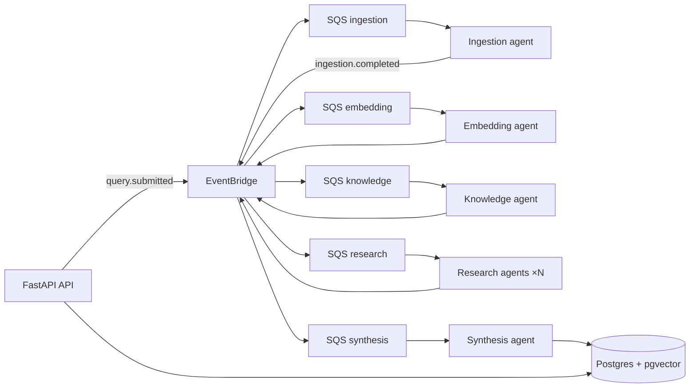

# EventForge

**Event-driven multi-agent research platform** — submit a topic, watch a pipeline of specialized agents investigate it in parallel, and get a structured synthesis with sources.

Built as a **portfolio-grade** full-stack project: production patterns (idempotency, DLQ, correlation IDs, cost tracking) over a real AWS event architecture — not a single-shot ChatGPT wrapper.

---

## End goal

Turn open-ended research questions into **cited, multi-source syntheses** you can trust — and show *how* the answer was built, not just the answer.

| For | EventForge delivers |
|-----|---------------------|
| **Researchers** | Deep investigation across web sources, chunked + embedded for RAG, parallel sub-queries, merged report |
| **Hiring managers** | Evidence of distributed systems, event-driven design, observability, and cloud-native ops |
| **Developers (me)** | A demo-ready piece spanning FastAPI, EventBridge/SQS, pgvector, LLM agents, and a live React Flow dashboard |

**MVP done when:** A user submits a query → real agents run end-to-end → synthesis lands in the DB with citations → UI shows live pipeline progress and cost.

---

## Where things stand

**Strategy:** Backend-first. API + workers are testable via Postman/curl today; the Next.js dashboard comes after real AI agents work.

| Phase | Focus | Status |
|-------|--------|--------|
| **0** | Docs, Docker, LocalStack, Postgres + pgvector | ✅ Done |
| **1** | FastAPI backend, health checks, SQLAlchemy, Alembic | ✅ Done |
| **2** | Event pipeline with **stub agents** (ingestion → synthesis), DLQ, idempotency | ✅ Done |
| **3** | **Real AI** — Tavily, embeddings, RAG knowledge mining; research + synthesis + auth next | 🚧 **In progress** (KRE-139–141, KRE-143 done) |
| **4** | Next.js UI, SSE live updates, React Flow visualization, Clerk | Planned |
| **5** | AWS deploy (Terraform, ECS, Step Functions fan-out) | Planned |
| **6** | Polish — demo GIF, E2E tests, RAG eval, cost dashboard | Planned |

Detail: [`docs/TASKS.md`](./docs/TASKS.md) · Linear: [`docs/LINEAR.md`](./docs/LINEAR.md)

---

## What works today

The **full event pipeline runs locally**. Ingestion through knowledge mining use **real AI**; research and synthesis still use Phase 2 stubs until [KRE-142](https://linear.app/kreativbiro/issue/KRE-142) / [KRE-144](https://linear.app/kreativbiro/issue/KRE-144).

```
POST /api/v1/queries  →  EventBridge  →  SQS workers  →  Postgres  →  GET /api/v1/queries/{id}
```

| Capability | Status |
|------------|--------|
| Submit query, list jobs, job detail + stages | ✅ REST API |
| EventBridge → SQS → 5 stage workers + DLQ handler | ✅ LocalStack |
| Idempotent processing (`processed_events`) | ✅ |
| SQS redrive → DLQ after 3 failures | ✅ |
| `pipeline.failed` terminal failure events | ✅ |
| LLM client (OpenAI + Anthropic, config-driven pricing) | ✅ [KRE-139](https://linear.app/kreativbiro/issue/KRE-139) |
| Per-call cost logging (`llm_usage` table) | ✅ [KRE-139](https://linear.app/kreativbiro/issue/KRE-139) |
| Tavily web search ingestion | ✅ [KRE-140](https://linear.app/kreativbiro/issue/KRE-140) |
| Real chunking + OpenAI `text-embedding-3-small` → pgvector | ✅ [KRE-141](https://linear.app/kreativbiro/issue/KRE-141) |
| RAG knowledge mining (vector retrieval + LLM entity extraction) | ✅ [KRE-143](https://linear.app/kreativbiro/issue/KRE-143) |
| Real LLM research notes + cited synthesis | ⬜ [KRE-142](https://linear.app/kreativbiro/issue/KRE-142) / [KRE-144](https://linear.app/kreativbiro/issue/KRE-144) |
| LLM cost API endpoint | ⬜ [KRE-145](https://linear.app/kreativbiro/issue/KRE-145) |
| Backend JWT auth (Clerk) | ⬜ [KRE-146](https://linear.app/kreativbiro/issue/KRE-146) |
| Dashboard / React Flow | ⬜ Phase 4 |

**Smoke test:** `./scripts/verify-pipeline-e2e.sh` (requires API + all workers running — see [Local dev](#local-dev))

---

## Architecture (at a glance)



Agents communicate via **events only** (no agent-to-agent HTTP). Every event carries `correlation_id` for tracing end-to-end.

Full diagrams: [`docs/ARCHITECTURE.md`](./docs/ARCHITECTURE.md)

---

## Stack

| Layer | Tech |
|-------|------|
| **API** | Python 3.12+, FastAPI, Pydantic v2, SQLAlchemy 2.0, uv |
| **Workers** | Async SQS consumers, one module per pipeline stage |
| **Events** | AWS EventBridge + SQS (+ Step Functions for research fan-out in prod) |
| **Data** | Postgres 16 + pgvector |
| **LLM** *(Phase 3)* | OpenAI + Anthropic client; Tavily search; OpenAI embeddings; RAG entity extraction |
| **Frontend** *(Phase 4)* | Next.js 15, Tailwind, shadcn/ui, React Flow |
| **Auth** *(Phase 3–4)* | Clerk JWT → FastAPI |
| **IaC** *(Phase 5)* | Terraform |
| **Local** | Docker Compose + LocalStack |

---

## Local dev

**Prerequisites:** Docker, Python 3.12+, [uv](https://docs.astral.sh/uv/)

```bash
cp .env.example .env
./scripts/setup-local.sh    # first time
make dev                    # Postgres + LocalStack + backend

cd backend && uv run alembic upgrade head   # migrations
```

**Phase 3 API keys** (in `.env` — required for real ingestion → knowledge path):

```bash
OPENAI_API_KEY=sk-...
ANTHROPIC_API_KEY=sk-ant-...   # optional second provider
TAVILY_API_KEY=tvly-...        # web search (ingestion)
LLM_DEFAULT_MODEL=gpt-4o-mini
KNOWLEDGE_RAG_TOP_K=10         # optional — RAG retrieval limit
```

**Hybrid (hot reload):** run infra in Docker, API natively:

```bash
docker compose up postgres localstack
cd backend && uv sync && uv run uvicorn eventforge.main:app --reload --port 8000
```

**Workers** (one terminal each — required for pipeline to complete):

```bash
uv run --project backend python -m eventforge.workers.ingestion
uv run --project backend python -m eventforge.workers.embedding
uv run --project backend python -m eventforge.workers.knowledge
uv run --project backend python -m eventforge.workers.research
uv run --project backend python -m eventforge.workers.synthesis
```

**Try the API:**

```bash
# Health
curl http://localhost:8000/health

# Submit a query
curl -X POST http://localhost:8000/api/v1/queries \
  -H "Content-Type: application/json" \
  -d '{"topic": "Event-driven architecture patterns", "depth": "standard"}'

# Poll job detail (use job_id from response)
curl http://localhost:8000/api/v1/queries/{job_id}
```

OpenAPI docs: http://localhost:8000/docs

Full guide: [`docs/LOCAL_DEV.md`](./docs/LOCAL_DEV.md)

---

## Project structure

```
event-driven/
├── backend/src/eventforge/   # API, agents, workers, events, db
│   ├── services/llm/         # LLM client + OpenAI/Anthropic providers
│   ├── services/embedding/   # Chunking + OpenAI embeddings
│   ├── services/knowledge/   # RAG retrieval + entity extraction
│   └── services/search/      # Tavily client
├── shared/events/            # JSON Schema contracts (source of truth)
├── infra/                    # Terraform, LocalStack init, Docker
├── docs/                     # PRD, architecture, ADRs, roadmap
├── scripts/                  # setup, E2E verify, seed
└── frontend/                 # Phase 4 — not scaffolded yet
```

---

## Documentation

| Doc | Purpose |
|-----|---------|
| [`docs/ARCHITECTURE.md`](./docs/ARCHITECTURE.md) | System design, event flows, diagrams |
| [`docs/PRD.md`](./docs/PRD.md) | Product vision and user stories |
| [`docs/TASKS.md`](./docs/TASKS.md) | Phase roadmap and checkboxes |
| [`docs/TECH_DECISIONS.md`](./docs/TECH_DECISIONS.md) | ADRs (Tavily, pgvector, SSE, etc.) |
| [`docs/LOCAL_DEV.md`](./docs/LOCAL_DEV.md) | Troubleshooting and worker setup |

For Cursor agents: [AGENTS.md](./AGENTS.md) · [`.cursor/rules/`](./.cursor/rules/)

---

## License

MIT — portfolio project.
