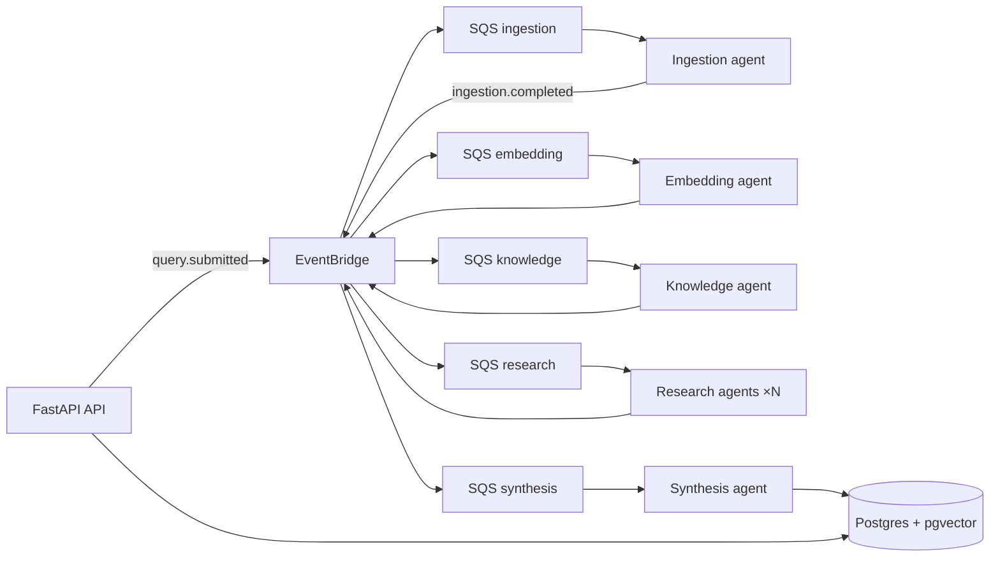

# EventForge

**Event-driven multi-agent research platform** — submit a topic, watch a pipeline of specialized agents investigate it in parallel, and get a structured synthesis with sources.

Built as a **portfolio-grade** full-stack project: production patterns (idempotency, DLQ, correlation IDs, cost tracking) over a real AWS event architecture — not a single-shot ChatGPT wrapper.

---

## End goal

Turn open-ended research questions into **cited, multi-source syntheses** you can trust — and show _how_ the answer was built, not just the answer.

| For                 | EventForge delivers                                                                                         |
| ------------------- | ----------------------------------------------------------------------------------------------------------- |
| **Researchers**     | Deep investigation across web sources, chunked + embedded for RAG, parallel sub-queries, merged report      |
| **Hiring managers** | Evidence of distributed systems, event-driven design, observability, and cloud-native ops                   |
| **Developers (me)** | A demo-ready piece spanning FastAPI, EventBridge/SQS, pgvector, LLM agents, and a live React Flow dashboard |

**MVP done when:** A user submits a query → real agents run end-to-end → synthesis lands in the DB with citations → UI shows live pipeline progress and cost.

**Backend MVP (Phase 3):** Real cited synthesis + Cognito JWT auth ✅ — Phase 3 exit complete.

---

## Where things stand

**Strategy:** Phases 0–4 complete. **Phase 5 in progress** — ADR-012 all-in-AWS ECS; Terraform `networking` + `ecs` modules + `environments/dev` ✅. **Next:** RDS, SQS, EventBridge, Cognito modules.

| Phase | Focus                                                                         | Status                                                                                                                                                                                                                                                                                                                    |
| ----- | ----------------------------------------------------------------------------- | ------------------------------------------------------------------------------------------------------------------------------------------------------------------------------------------------------------------------------------------------------------------------------------------------------------------------- |
| **0** | Docs, Docker, LocalStack, Postgres + pgvector                                 | ✅ Done                                                                                                                                                                                                                                                                                                                   |
| **1** | FastAPI backend, health checks, SQLAlchemy, Alembic                           | ✅ Done                                                                                                                                                                                                                                                                                                                   |
| **2** | Event pipeline with **stub agents** (ingestion → synthesis), DLQ, idempotency | ✅ Done                                                                                                                                                                                                                                                                                                                   |
| **3** | **Real AI** — full agent pipeline, cost API, resilience, Cognito auth         | ✅ **Complete**                                                                                                                                                                                                                                                                                                           |
| **4** | Next.js UI, SSE, React Flow, dashboard, Cognito UI, OTEL                      | ✅ **Complete** — [KRE-151](https://linear.app/kreativbiro/issue/KRE-151) SSE · [KRE-152](https://linear.app/kreativbiro/issue/KRE-152) React Flow · [KRE-153](https://linear.app/kreativbiro/issue/KRE-153) dashboard · [KRE-154](https://linear.app/kreativbiro/issue/KRE-154) Cognito UI · [KRE-155](https://linear.app/kreativbiro/issue/KRE-155) OTEL local |
| **5** | AWS deploy (Terraform, ECS, Step Functions fan-out)                           | **In progress** — networking + ECS modules, ADR-012; RDS/SQS/Cognito next                                                                                                                                                                                                                                                 |
| **6** | Polish — demo GIF, E2E tests, RAG eval, cost dashboard                        | Planned                                                                                                                                                                                                                                                                                                                   |

Detail: [`docs/TASKS.md`](./docs/TASKS.md) · Linear: [`docs/LINEAR.md`](./docs/LINEAR.md)

---

## What works today

The **full event pipeline runs locally** with **real AI** end-to-end (ingestion → synthesis).

```
POST /api/v1/queries  →  EventBridge  →  SQS workers  →  Postgres  →  GET /api/v1/queries/{id}
```

| Capability                                                           | Status                                                                                                                                    |
| -------------------------------------------------------------------- | ----------------------------------------------------------------------------------------------------------------------------------------- |
| Submit query, list jobs, job detail + stages                         | ✅ REST API                                                                                                                               |
| EventBridge → SQS → 5 stage workers + DLQ handler                    | ✅ LocalStack                                                                                                                             |
| Idempotent processing (`processed_events`)                           | ✅                                                                                                                                        |
| SQS redrive → DLQ after 3 failures                                   | ✅                                                                                                                                        |
| `pipeline.failed` terminal failure events                            | ✅                                                                                                                                        |
| LLM client (OpenAI + Anthropic, config-driven pricing)               | ✅ [KRE-139](https://linear.app/kreativbiro/issue/KRE-139)                                                                                |
| Per-call cost logging (`llm_usage` table)                            | ✅ [KRE-139](https://linear.app/kreativbiro/issue/KRE-139)                                                                                |
| Tavily web search ingestion                                          | ✅ [KRE-140](https://linear.app/kreativbiro/issue/KRE-140)                                                                                |
| Real chunking + OpenAI `text-embedding-3-small` → pgvector           | ✅ [KRE-141](https://linear.app/kreativbiro/issue/KRE-141)                                                                                |
| RAG knowledge mining (vector retrieval + LLM entity extraction)      | ✅ [KRE-143](https://linear.app/kreativbiro/issue/KRE-143)                                                                                |
| Real LLM research notes + cited synthesis                            | ✅ [KRE-142](https://linear.app/kreativbiro/issue/KRE-142) / ✅ [KRE-144](https://linear.app/kreativbiro/issue/KRE-144)                   |
| LLM cost summary on `GET /api/v1/queries/{id}`                       | ✅ [KRE-145](https://linear.app/kreativbiro/issue/KRE-145)                                                                                |
| LLM resilience (retry, circuit breaker, per-job cost cap)            | ✅ [KRE-147](https://linear.app/kreativbiro/issue/KRE-147)                                                                                |
| Backend JWT auth (Cognito)                                           | ✅ [KRE-146](https://linear.app/kreativbiro/issue/KRE-146) — `AUTH_DISABLED=true` for E2E; real pool via `./scripts/get-cognito-token.sh` |
| Next.js scaffold (App Router, Tailwind, shadcn/ui)                   | ✅ [KRE-119](https://linear.app/kreativbiro/issue/KRE-119)                                                                                |
| App shell + placeholder pages (`/`, `/queries/new`, `/queries/[id]`) | ✅ [KRE-121](https://linear.app/kreativbiro/issue/KRE-121)                                                                                |
| API client + Docker Compose frontend service                         | ✅ [KRE-124](https://linear.app/kreativbiro/issue/KRE-124)                                                                                |
| Full-stack smoke test (`verify-fullstack.sh`)                        | ✅ [KRE-128](https://linear.app/kreativbiro/issue/KRE-128)                                                                                |
| SSE live pipeline updates (`useJobStream` + `/queries/{id}/stream`)  | ✅ [KRE-151](https://linear.app/kreativbiro/issue/KRE-151)                                                                                |
| Live React Flow dashboard                                            | ✅ [KRE-152](https://linear.app/kreativbiro/issue/KRE-152)                                                                                |
| Dashboard UI — submit query, job history, synthesis, sources, cost   | ✅ [KRE-153](https://linear.app/kreativbiro/issue/KRE-153)                                                                                |
| Cognito sign-in UI — Amplify Auth, Bearer token, route guard         | ✅ [KRE-154](https://linear.app/kreativbiro/issue/KRE-154)                                                                                |
| Local OTEL — FastAPI + worker spans, collector, Jaeger UI            | ✅ [KRE-155](https://linear.app/kreativbiro/issue/KRE-155)                                                                                |

**Smoke test:** `./scripts/verify-pipeline-e2e.sh` or `make verify-e2e` (API + all workers; real LLM run ~2–3 min with one research worker)

**Full-stack scaffold:** `./scripts/verify-fullstack.sh` or `make verify-fullstack` (compose stack + frontend UI; no workers required)

---

## Architecture (at a glance)



Agents communicate via **events only** (no agent-to-agent HTTP). Every event carries `correlation_id` for tracing end-to-end.

Full diagrams: [`docs/ARCHITECTURE.md`](./docs/ARCHITECTURE.md)

---

## Stack

| Layer                    | Tech                                                                                                                        |
| ------------------------ | --------------------------------------------------------------------------------------------------------------------------- |
| **API**                  | Python 3.12+, FastAPI, Pydantic v2, SQLAlchemy 2.0, uv                                                                      |
| **Workers**              | Async SQS consumers, one module per pipeline stage                                                                          |
| **Events**               | AWS EventBridge + SQS (+ Step Functions for research fan-out in prod)                                                       |
| **Data**                 | Postgres 16 + pgvector                                                                                                      |
| **LLM**                  | OpenAI + Anthropic client; Tavily search; OpenAI embeddings; RAG; cited synthesis                                           |
| **Resilience**           | Exponential backoff retries, per-provider circuit breakers, optional `JOB_MAX_COST_USD`                                     |
| **Frontend** _(Phase 4)_ | Next.js 16, shadcn/ui, TanStack Query, React Flow, SSE, Amplify Cognito UI ✅                                               |
| **Auth** _(Phase 3–4)_   | Cognito JWT → FastAPI ✅ · Amplify sign-in + Bearer on API/SSE ✅ ([KRE-154](https://linear.app/kreativbiro/issue/KRE-154)) |
| **Observability**        | OpenTelemetry → OTLP collector → Jaeger ✅ ([KRE-155](https://linear.app/kreativbiro/issue/KRE-155))                        |
| **IaC** _(Phase 5)_      | Terraform — `modules/networking`, `modules/ecs`, `environments/dev` ([ADR-012](./docs/TECH_DECISIONS.md#adr-012-all-in-aws-deployment-on-ecs-fargate)) |
| **Local**                | Docker Compose + LocalStack                                                                                                 |

---

## Local dev

**Prerequisites:** Docker, Python 3.12+, [uv](https://docs.astral.sh/uv/)

```bash
cp .env.example .env
./scripts/setup-local.sh    # first time
make dev                    # Postgres + LocalStack + backend + frontend + OTEL + Jaeger

cd backend && uv run alembic upgrade head   # migrations
```

| Service  | URL                        |
| -------- | -------------------------- |
| Frontend | http://localhost:3000      |
| Backend  | http://localhost:8000      |
| API docs | http://localhost:8000/docs |
| Jaeger   | http://localhost:16686     |

**Phase 3 API keys** (in `.env` — required for real ingestion → synthesis path):

```bash
OPENAI_API_KEY=sk-...
ANTHROPIC_API_KEY=sk-ant-...   # optional second provider
TAVILY_API_KEY=tvly-...        # web search (ingestion)
LLM_DEFAULT_MODEL=gpt-4o-mini
KNOWLEDGE_RAG_TOP_K=10         # optional — RAG retrieval limit
KNOWLEDGE_MAX_ENTITIES=4       # optional — caps research fan-out
JOB_MAX_COST_USD=2.0           # optional — per-job LLM spend cap (omit to disable)
```

**Hybrid (hot reload):** run infra in Docker, API + frontend natively:

```bash
docker compose up postgres localstack
cd backend && uv sync && uv run uvicorn eventforge.main:app --reload --port 8000
cd frontend && cp .env.example .env.local && npm install && npm run dev   # http://localhost:3000
```

**Workers** (required for pipeline to complete):

```bash
make workers   # all 5 workers + DLQ handler via Honcho (Procfile)
```

**Observability** (OTEL + Jaeger — included in `make dev`):

```bash
# .env
OTEL_ENABLED=true
OTEL_EXPORTER_OTLP_ENDPOINT=http://localhost:4317   # host workers
OTEL_SERVICE_NAME=eventforge

# Jaeger UI — after submitting a query + running workers
open http://localhost:16686
```

Search by **Service** (`eventforge`, `eventforge-worker-ingestion`, …) or tag `correlation_id=<from query response>`. Disable with `OTEL_ENABLED=false`.

Detail: [`docs/LOCAL_DEV.md`](./docs/LOCAL_DEV.md#observability-phase-4)

Or one terminal each:

```bash
uv run --project backend python -m eventforge.workers.ingestion
uv run --project backend python -m eventforge.workers.embedding
uv run --project backend python -m eventforge.workers.knowledge
uv run --project backend python -m eventforge.workers.research
uv run --project backend python -m eventforge.workers.synthesis
```

**Local setup (3 terminals for hybrid):** `make dev` (full stack) · or infra + `make workers` · API calls below.

Header **API ok** badge on http://localhost:3000 confirms frontend → backend health via `lib/api-client.ts`.

**Regions:** `AWS_REGION=us-east-1` for LocalStack; `COGNITO_REGION=eu-west-2` for real Cognito pool.

**Try the API:**

```bash
# Health (no auth)
curl http://localhost:8000/health

# E2E script path — set AUTH_DISABLED=true in .env
./scripts/verify-pipeline-e2e.sh

# Real Cognito auth — fetch ID token, then submit
TOKEN=$(./scripts/get-cognito-token.sh)
curl -X POST http://localhost:8000/api/v1/queries \
  -H "Authorization: Bearer $TOKEN" \
  -H "Content-Type: application/json" \
  -d '{"topic": "Event-driven architecture patterns", "depth": "standard"}'

# Poll job detail (use job_id from response) — includes stages, synthesis, llm_usage
curl -H "Authorization: Bearer $TOKEN" http://localhost:8000/api/v1/queries/{job_id}
```

OpenAPI docs: http://localhost:8000/docs

Full guide: [`docs/LOCAL_DEV.md`](./docs/LOCAL_DEV.md)

---

## Project structure

```
event-driven/
├── backend/src/eventforge/   # API, agents, workers, events, db
│   ├── core/otel.py          # OTEL setup + agent span helpers
│   ├── services/llm/         # LLM client + OpenAI/Anthropic providers
│   ├── services/embedding/   # Chunking + OpenAI embeddings
│   ├── services/knowledge/   # RAG retrieval + entity extraction
│   ├── services/research/    # Sub-query generation + note synthesis
│   ├── services/synthesis/   # Cited report generation
│   ├── services/resilience/  # Retry, circuit breaker, cost cap
│   └── services/search/      # Tavily client
├── shared/events/            # JSON Schema contracts (source of truth)
├── infra/                    # Terraform (Phase 5), LocalStack init, Docker, OTEL
│   └── terraform/            # modules/networking, modules/ecs, environments/dev
├── docs/                     # PRD, architecture, ADRs, roadmap
├── scripts/                  # setup, E2E verify, seed
└── frontend/                 # Next.js app (Phase 4)
    └── src/
        ├── app/              # /, /login, /queries/new, /queries/[id]
        ├── components/       # layout, auth, dashboard, workflow (React Flow), shadcn/ui
        ├── hooks/            # useJobStream (SSE), use-queries (TanStack Query)
        ├── lib/              # api-client, auth-config, auth-token, sse-client
        └── types/api.ts      # generated from OpenAPI (npm run codegen)
```

---

## Documentation

| Doc                                                  | Purpose                              |
| ---------------------------------------------------- | ------------------------------------ |
| [`docs/ARCHITECTURE.md`](./docs/ARCHITECTURE.md)     | System design, event flows, diagrams |
| [`docs/PRD.md`](./docs/PRD.md)                       | Product vision and user stories      |
| [`docs/TASKS.md`](./docs/TASKS.md)                   | Phase roadmap and checkboxes         |
| [`docs/TECH_DECISIONS.md`](./docs/TECH_DECISIONS.md) | ADRs (Tavily, pgvector, SSE, etc.)   |
| [`docs/LOCAL_DEV.md`](./docs/LOCAL_DEV.md)           | Troubleshooting and worker setup     |

For Cursor agents: [AGENTS.md](./AGENTS.md) · [`.cursor/rules/`](./.cursor/rules/)

---

## License

MIT — portfolio project.
