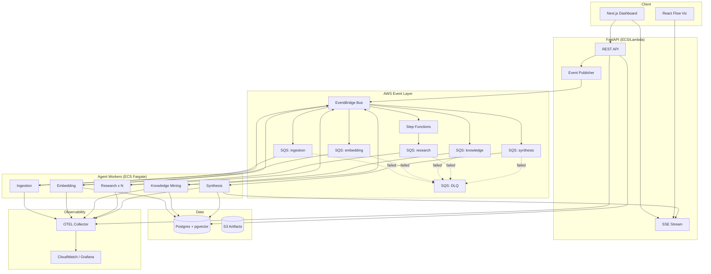
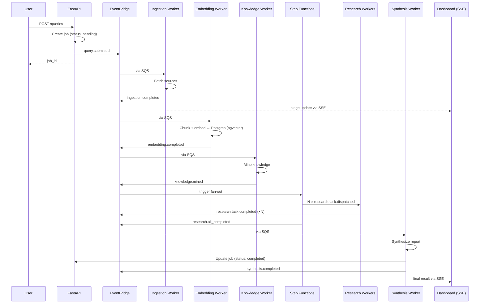
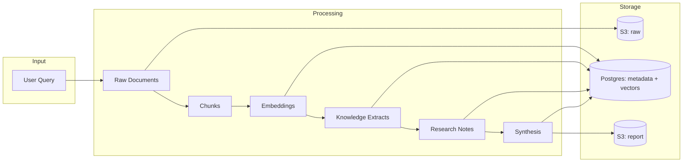
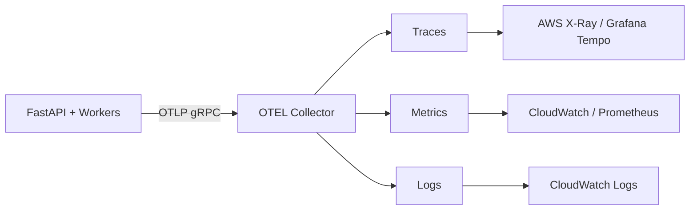

# EventForge — System Architecture

> **Cursor agents:** Summary in `.cursor/rules/eventforge-core.mdc` + `.cursor/rules/event-pipeline.mdc`. This doc has full Mermaid diagrams.

**Version:** 0.1  
**Last updated:** 2025-06-20

---

## 1. High-Level Overview

EventForge is a **hybrid architecture**: a Next.js frontend for UX and real-time visualization, a FastAPI backend for API and agent logic, and AWS managed services for event orchestration and persistence.



---

## 2. Component Breakdown

### 2.1 Frontend (Next.js 15)

| Component               | Responsibility                           |
| ----------------------- | ---------------------------------------- |
| `app/` routes           | Query form, job detail, history          |
| `components/workflow/`  | React Flow pipeline visualization        |
| `components/dashboard/` | Synthesis viewer, sources, cost panel    |
| `hooks/useJobStream`    | SSE subscription for live updates        |
| `lib/api-client`        | Typed fetch from OpenAPI-generated types |

**Realtime strategy:** Server-Sent Events from FastAPI. Each pipeline event updates React Flow node state and a timeline log.

### 2.2 Backend API (FastAPI)

| Module               | Responsibility                         |
| -------------------- | -------------------------------------- |
| `api/routes/queries` | CRUD for research jobs                 |
| `api/routes/stream`  | SSE endpoint keyed by `correlation_id` |
| `events/publisher`   | PutEvents to EventBridge               |
| `db/models`          | Job, Stage, Source, LLMUsage, User     |
| `core/otel`          | Tracer provider, span helpers          |
| `services/cost`      | Token → USD calculation                |

Runs as a stateless API service. No long-running agent work in request handlers.

### 2.3 Agent Workers

Each worker is a **long-polling SQS consumer** (or Lambda for lighter stages in future). Workers:

1. Receive message with `event_id`, `correlation_id`, `job_id`, `payload`
2. Check idempotency (processed events table)
3. Execute agent logic with OTEL span
4. Persist results to Postgres (including pgvector embeddings)
5. Publish next-stage event to EventBridge
6. Delete SQS message on success; leave for retry on failure

| Worker    | Input Event                | Output Event              | External Deps                   |
| --------- | -------------------------- | ------------------------- | ------------------------------- |
| Ingestion | `query.submitted`          | `ingestion.completed`     | Tavily API                      |
| Embedding | `ingestion.completed`      | `embedding.completed`     | OpenAI embeddings, pgvector     |
| Knowledge | `embedding.completed`      | `knowledge.mined`         | pgvector similarity search, LLM |
| Research  | `research.task.dispatched` | `research.task.completed` | LLM, web search                 |
| Synthesis | all research done          | `synthesis.completed`     | LLM                             |

### 2.4 Orchestration

**EventBridge** is the central nervous system. Rules route events to SQS queues by `detail-type`.

**Step Functions** handles the **research fan-out**:

1. Knowledge mining completes → Step Function triggered
2. SF generates N research sub-tasks (Map state)
3. Each sub-task message → `eventforge-research` SQS
4. SF waits for all completions (callback or polling pattern)
5. On all complete → emit event to synthesis queue

### 2.5 Data Stores

| Store                   | Data                                                                                    |
| ----------------------- | --------------------------------------------------------------------------------------- |
| **Postgres + pgvector** | Users, jobs, stages, sources, llm_usage, processed_events, document chunks + embeddings |
| **S3**                  | Raw fetched documents, final synthesis artifacts (optional)                             |

---

## 3. Event Flow (Detailed)



---

## 4. Data Flow



---

## 5. Idempotency & Resilience

### Idempotency

```
processed_events(event_id PK, worker_name, processed_at)
```

Before processing, worker checks `event_id`. If exists → ack message, skip. Insert within same DB transaction as side effects.

### Retry Policy

| Layer          | Policy                                                         |
| -------------- | -------------------------------------------------------------- |
| SQS            | `maxReceiveCount: 3`, visibility timeout ≥ p99 processing time |
| DLQ            | `eventforge-dlq` — alert on CloudWatch metric                  |
| Step Functions | Retry on `States.TaskFailed` with backoff                      |
| LLM calls      | 3 retries, exponential backoff, circuit breaker per provider   |

### Failure Handling

On terminal failure:

1. Update job stage → `failed` with error detail
2. Emit `pipeline.failed` event
3. Message in DLQ
4. SSE pushes failure to UI (red node in React Flow)

---

## 6. Security Model

| Layer   | Approach                                                                 |
| ------- | ------------------------------------------------------------------------ |
| Auth    | Mock user via `get_current_user` on every request (ADR-013)              |
| API     | Rate limiting per user (Redis or in-memory local)                        |
| Data    | `user_id` on all job rows; queries scoped in repository layer            |
| Secrets | AWS Secrets Manager in prod; `.env` local only                           |
| Network | Private subnets for workers/RDS; ALB for API only                        |
| IAM     | Least-privilege per worker role (SQS consume, EB publish, S3 read/write) |

---

## 7. Observability



**Span naming:** `agent.{name}.{action}` e.g. `agent.ingestion.fetch_sources`

**Required attributes:** `correlation_id`, `job_id`, `event_id`, `agent_name`, `model`, `token_count`

---

## 8. Local vs Production

| Concern             | Local (Docker Compose)          | Production (AWS)                          |
| ------------------- | ------------------------------- | ----------------------------------------- |
| EventBridge         | LocalStack                      | AWS EventBridge                           |
| SQS                 | LocalStack                      | AWS SQS                                   |
| Step Functions      | LocalStack (limited)            | AWS Step Functions                        |
| Postgres            | Docker postgres:16              | RDS PostgreSQL                            |
| Postgres + pgvector | Docker `pgvector/pgvector:pg16` | RDS PostgreSQL with `vector` extension    |
| Workers             | `docker compose` sidecar        | ECS Fargate (auto-scaling on queue depth) |
| API                 | Uvicorn hot-reload              | ECS Fargate behind ALB                    |
| Frontend            | `next dev`                      | Vercel or CloudFront + S3                 |
| OTEL                | Local collector container       | ADOT sidecar → Grafana Cloud              |

---

## 9. Key Design Decisions

See `docs/TECH_DECISIONS.md` for full ADRs. Summary:

1. **Hybrid stack** — Next.js for UX, Python for AI/agent ecosystem
2. **EventBridge over direct HTTP** — decoupling, replay, audit trail
3. **SQS per stage** — independent scaling and failure domains
4. **Step Functions for fan-out** — visual workflow, built-in retry/wait
5. **pgvector in Postgres** — single store for MVP; dedicated vector DB (Qdrant) as future scale path
6. **SSE over WebSocket** — unidirectional updates sufficient for MVP

---

## 10. API Surface (Planned)

```
POST   /api/v1/queries              # Submit research query
GET    /api/v1/queries              # List user's queries
GET    /api/v1/queries/{id}         # Get job detail + result
GET    /api/v1/queries/{id}/stream  # SSE pipeline events
GET    /api/v1/queries/{id}/cost    # LLM cost breakdown
POST   /api/v1/admin/dlq/replay     # Replay DLQ message (admin)
GET    /api/v1/health               # Health check
GET    /api/v1/health/ready         # Readiness (DB + pgvector, EB)
```
